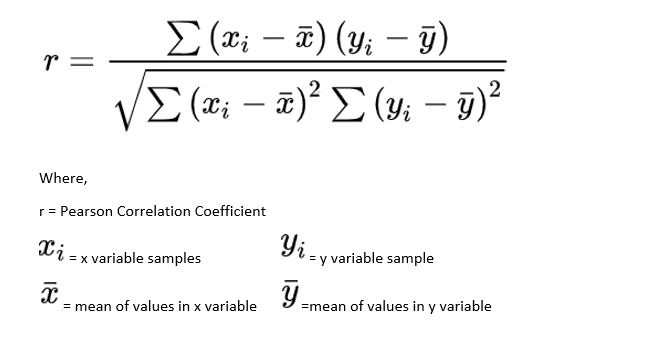
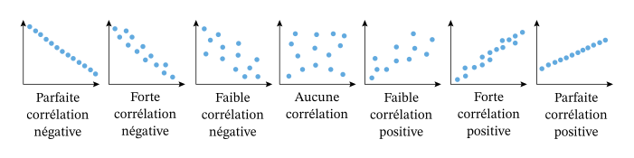

# Veille Informatique sur le Machine Learning

## Introduction

Le Machine Learning est une branche de l'intelligence artificielle qui permet à des ordinateurs d'apprendre à partir de données. Il existe plusieurs types de Machine Learning, dont le Machine Learning supervisé, le Machine Learning non supervisé et le Machine Learning par renforcement. Le Machine Learning est utilisé dans de nombreux domaines, tels que la finance, la santé, la sécurité, le marketing, etc.

## 1.La science des données

La science des données est l'étude de l'extraction automatisée de connaissance à partir de grands ensembles de données.

Il s'agit d'une approche pluridisciplinaire qui combine des compétences en mathématiques, en statistiques, en informatique et en domaines d'application en vue d'analyser de grands volumes de données brutes structurées ou non.

Sources : [Wikipedia](https://fr.wikipedia.org/wiki/Science_des_donn%C3%A9es) /
[AWS](https://aws.amazon.com/fr/what-is/data-science/#:~:text=La%20science%20des%20donn%C3%A9es%20est%20un%20terme%20g%C3%A9n%C3%A9rique%20qui%20recouvre,math%C3%A9matiques%20et%20l'analyse%20statistique.)

## 2.L'apprentissage automatique

L'apprentissage automatique (machine learning) est un champ d'étude de l'intelligence artificielle qui vise à donner aux ordinateurs la capacité d' "apprendre" à partir de données, via des modèles mathématiques. Plus précisément, il s'agit du procédé par lequel les informations pertinentes sont tirées d'un ensemble de données d'entrainement.

Le but de cette phase est l'obtention des [paramètres](#22les-paramètres-dun-modèle) d'un [modèle](#21les-modèles) qui atteindront les performances souhaitées.

Sources : [CNIL](https://www.cnil.fr/fr/definition/apprentissage-automatique#:~:text=L'apprentissage%20automatique%20(machine%20learning,donn%C3%A9es%2C%20via%20des%20mod%C3%A8les%20math%C3%A9matiques.))

### 2.1.Les modèles

Le modèle d'IA est la construction mathématique générant une déduction ou une prédiction à partir de données d'entrée.

Sources : [CNIL](https://www.cnil.fr/fr/definition/modele-ia)

### 2.2.Les paramètres d'un modèle

Dans l'IA, le paramètre est la propriété apprise des données utilisées pour l'entrainement.

Sources : [CNIL](https://www.cnil.fr/fr/definition/parametre-ia)

## 3.L'apprentissage profond

L'apprentissage profond (deep learning) est une méthode d'apprentissage automatique qui se base sur des réseaux de [neurones artificiels](#31les-réseaux-de-neurones-artificiels), possédants plusieurs couches de neurones cachées.
Ces algorithmes possédant de très nombreux paramètres, ils demandent un nombre conséquent de données pour être entrainés.

Sources : [CNIL](https://www.cnil.fr/fr/definition/apprentissage-profond-deep-learning#:~:text=L'apprentissage%20profond%20est%20un,donn%C3%A9es%20afin%20d'%C3%AAtre%20entra%C3%AEn%C3%A9s.)

### 3.1.Les réseaux de neurones artificiels

Un réseau de neurones artificiels est un ensemble de [neurones](#311les-neurones) permettant la résolution de problèmes complexes tels que la [vision par ordinateur](#312la-vision-par-ordinateur) ou le [traitement automatique du langage naturel](#le-traitement-automatique-du-langage-naturel).

Sources : [CNIL](https://www.cnil.fr/fr/definition/reseau-de-neurones-artificiels-artificial-neural-network)

#### 3.1.1.Les neurones

Un neurone artificiel fonctionne d'une manière similaire à un neurone biologique. Un nœud d'un réseau de neurones reçoit généralement plusieurs valeurs d'entrées, effectue un calcul sur ces entrées, puis renvoie une valeur de sortie.

Sources : [CNIL](https://www.cnil.fr/fr/definition/neurone-artificiel)

#### 3.1.2.La vision par ordinateur

La vision par ordinateur est une branche de l'intelligence artificielle dont le but principal est de permettre à une machine de "voir" et d'interpréter des images ou des vidéos.

Sources : [CNIL](https://www.cnil.fr/fr/definition/vision-par-ordinateur-computer-vision)

#### 3.1.3.Le traitement automatique du langage naturel

Le traitement automatique du langage naturel (TALN) est un domaine multidisciplinaire impliquant la linguistique, l'informatique et l'intelligence artificielle. Il a pour objectif de permettre à une machine de comprendre, d'interpréter et de générer un langage humain pour diverse applications.

Sources : [CNIL](https://www.cnil.fr/fr/definition/traitement-automatique-du-langage-naturel-natural-language-processing-ou-nlp)

## 4.L'apprentissage supervisé

L'apprentissage supervisé est une tâche d'apprentissage automatique qui consiste à apprendre une fonction de prédiction à partir de données d'entrainement étiquetées.

Sources : [Wikipedia](https://fr.wikipedia.org/wiki/Apprentissage_supervis%C3%A9#:~:text=L'apprentissage%20supervis%C3%A9%20(supervised%20learning,r%C3%A9gression%20des%20probl%C3%A8mes%20de%20classement.))

## 5.L'apprentissage non supervisé

L'apprentissage non supervisé est une tâche d'apprentissage opposée à l'apprentissage supervisé. Il s'agit d'extraire des caractéristique communes. La qualité d'une méthode de classification est mesurée par sa capacité à découvrir certains ou tous les motifs cachés.

Sources : [Wikipedia](https://fr.wikipedia.org/wiki/Apprentissage_non_supervis%C3%A9#:~:text=L'apprentissage%20non%20supervis%C3%A9%20consiste,ou%20tous%20les%20motifs%20cach%C3%A9s.)

## 6.La classification supervisée

Le classement automatique est la catégorisation algorithmique d'objets. Elle consiste à attribuer une classe ou catégorie à chaque objet (ou individu) à classer, en se fondant sur des données statistiques. Elle fait couramment appel à l'apprentissage automatique et est largement utilisée en [reconnaissance de formes](#61la-reconnaissance-de-formes).

Sources : [Wikipedia](https://fr.wikipedia.org/wiki/Classement_automatique#:~:text=Le%20classement%20automatique%20ou%20classification,fondant%20sur%20des%20donn%C3%A9es%20statistiques.)

### 6.1.La reconnaissance de formes

La reconnaissance de formes (ou reconnaissance de motif) est un ensemble de techniques et méthodes visant à identifier des régularités dans des données à partir d'informations brutes afin de prendre une décision dépendant de la catégorie attribuée à ce motid. On considère que cette branche fait largement appel à des métthodes de l'apprentissage automatique et aux statistiques.

Le mot forme est à comprendre au sens très général, pas seulement celui de "forme géométrique" mais plutôt de régularités ou motifs qui peuvent être de nature très variée.

Sources : [Wikipedia](https://fr.wikipedia.org/wiki/Reconnaissance_de_formes)

## 7.La classification non supervisée

L'apprentissage non supervisé désigne la situation d'apprentissage automatique où les données ne sont pas étiquetées. Puisque les données ne sont pas étiquetées, il est impossible pour l'algorithme de calculer de façon certaine un score de réussite mais plutôt sous forme de densités de probabilité.

Sources : [Wikipedia](https://fr.wikipedia.org/wiki/Apprentissage_non_supervis%C3%A9)

## 8.La régression (statistique)

En mathématiques, la régression recouvre plusieurs méthodes d'analyse statistique permettant d'approcher une variable à partir d'autres qui lui sont [corrélées](#81la-corrélation) / liées.

Sources : [Wikipedia](https://fr.wikipedia.org/wiki/R%C3%A9gression_(statistiques))

### 8.1.La corrélation

En probabilité et en statistiques, la corrélation entre plusieurs variables aléatoires ou statistiques est une notion de liaison qui contredit l'indépendance. Elle est utilisée pour déterminer si deux variables sont liées, et dans quelle mesure.

Sources : [Wikipedia](https://fr.wikipedia.org/wiki/Corr%C3%A9lation_(statistiques))

## 9.La validation croisée

La validation croisé est une méthode permettant de tester les performances d'un modèle prédictif de Machine Learning. Elle consiste à diviser le jeu de données en deux sous-ensembles : un ensemble d'entrainement et un ensemble de test.

Sources : [DataScientest](https://datascientest.com/cross-validation)

## 10.Les données d'entrainement

Le jeu de données d'entrainement (ou d'apprentissage) est un ensemble de données utilisé pour ajuster les paramètres du modèle. Le modèle est entrainé sur le jeu de donnée d'apprentissage à l'aide d'une méthode d'apprentissage supervisé, par exemple à l'aide de méthodes d'optimisation telles que [la descente de gradient](#15la-descente-de-gradient) ou [la decente de gradient stochastique](#151la-descente-de-gradient-stochastique).

## 11.Les données de validation

Par la suite, le modèle ajusté est utilisé pour prédire les valeurs de la variable cible sur un jeu de données de validation. Le jeu de données de validation est un ensemble de données utilisé pour évaluer les performances du modèle.

## 12.Les données de test

Enfin, Le jeu de données de test est un jeu de données utilisé pour fournir une évaluation impartiale d'un ajustement final du modèle sur le jeu de données d'apprentissage.Par ailleurs, si les données de test ne sont pas utilisées dans l'apprentissage, le jeu de données de test est également appelé jeu de données d'exclusion.

Sources : [Wikipedia](https://fr.wikipedia.org/wiki/Jeux_d%27entrainement,_de_validation_et_de_test)

## 13.Corrélation linéaire (de Pearson) entre deux variables

Le coefficient de Pearson est un indice reflétant une relation linéaire entre deux variables continues. Il est compris entre -1 et 1. Un coefficient de -1 indique une corrélation négative parfaite, un coefficient de 0 indique une absence de corrélation, et un coefficient de 1 indique une corrélation positive parfaite.

Le coefficient de Pearson est calculé à l'aide de la formule suivante :

Sources : [DataScientest    ](https://datascientest.com/correlations-de-pearson-et-de-spearman)

## 14.Une fonction de coût (ou de perte)

La fonction de perte est la quantification de l'écart entre les prévisions du modèle et les observations réelles du jeu de donnée utilisé pour l'entrainement. Elle est utilisée pour ajuster les paramètres du modèle.

Sources : [CNIL](https://www.cnil.fr/fr/definition/fonction-de-perte-ou-de-cout-loss-function#:~:text=Dans%20le%20domaine%20de%20l,donn%C3%A9e%20utilis%C3%A9%20pendant%20l'entra%C3%AEnement.)

## 15.La descente de gradient

La descente de gradient est un algorithme d'optimisation couramment utilisé pour entraîner des modèles d'apprentissage automatique et des réseaux neuronaux. Il s'agit d'une méthode qui agit spécifiquement comme un baromètre, évaluant la précision du modèle à chaque itération des mise à jour des paramètres.

Sources : [IBM](https://www.ibm.com/fr-fr/topics/gradient-descent)

### 15.1.La descente de gradient stochastique

La descente de gradient stochastique est une variante de la descente de gradient classique. Elle consiste à mettre à jour les paramètres du modèle à chaque itération en utilisant un seul exemple d'entrainement à la fois. Comme un seul exemple est utilisé à chaque itération, la descente de gradient stochastique est plus rapide que la descente de gradient classique car il est plus facile de les stocker en mémoire.

Sources : [IBM](https://www.ibm.com/fr-fr/topics/gradient-descent#:~:text=La%20descente%20de%20gradient%20stochastique%20(SGD)%20ex%C3%A9cute%20une%20%C3%A9poque%20d,de%20les%20stocker%20en%20m%C3%A9moire.)