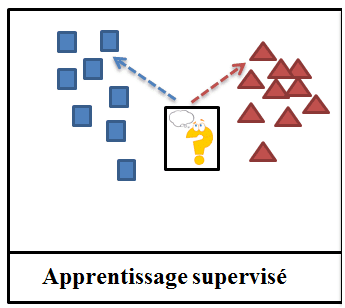

# Veille Informatique sur le Machine Learning

## Introduction

Le Machine Learning est une branche de l'intelligence artificielle qui permet à des ordinateurs d'apprendre à partir de données. Il existe plusieurs types de Machine Learning, dont le Machine Learning supervisé, le Machine Learning non supervisé et le Machine Learning par renforcement. Le Machine Learning est utilisé dans de nombreux domaines, tels que la finance, la santé, la sécurité, le marketing, etc.

## 1.La science des données

La science des données est l'étude de l'extraction automatisée de connaissance à partir de grands ensembles de données.

Il s'agit d'une approche pluridisciplinaire qui combine des compétences en mathématiques, en statistiques, en informatique et en domaines d'application en vue d'analyser de grands volumes de données brutes structurées ou non.

Sources : [Wikipedia](https://fr.wikipedia.org/wiki/Science_des_donn%C3%A9es) /
[AWS](https://aws.amazon.com/fr/what-is/data-science/#:~:text=La%20science%20des%20donn%C3%A9es%20est%20un%20terme%20g%C3%A9n%C3%A9rique%20qui%20recouvre,math%C3%A9matiques%20et%20l'analyse%20statistique.)

## 2.L'apprentissage automatique

L'apprentissage automatique (machine learning) est un champ d'étude de l'intelligence artificielle qui vise à donner aux ordinateurs la capacité d' "apprendre" à partir de données, via des modèles mathématiques. Plus précisément, il s'agit du procédé par lequel les informations pertinentes sont tirées d'un ensemble de données d'entrainement.

Le but de cette phase est l'obtention des [paramètres](#les-paramètres-dun-modèle) d'un [modèle](#les-modèles) qui atteindrons les performances souhaitées.

Sources : [CNIL](https://www.cnil.fr/fr/definition/apprentissage-automatique#:~:text=L'apprentissage%20automatique%20(machine%20learning,donn%C3%A9es%2C%20via%20des%20mod%C3%A8les%20math%C3%A9matiques.))

### 2.1.Les modèles

Le modèle d'IA est la construction mathématique générant une déduction ou une prédiction à partir de données d'entrée.

Sources : [CNIL](https://www.cnil.fr/fr/definition/modele-ia)

### 2.2.Les paramètres d'un modèle

Dans l'IA, le paramètre est la propriété apprise des données utilisées pour l'entrainement.

Sources : [CNIL](https://www.cnil.fr/fr/definition/parametre-ia)

## 3.L'apprentissage profond

L'apprentissage profond (deep learning) est une méthode d'apprentissage automatique qui se base sur des réseaux de [neurones artificiels](#les-réseaux-de-neurones-artificiels), possédants plusieurs couches de neurones cachées.
Ces algorithmes possédant de très nombreux paramètres, ils demandent un nombre conséquent de données pour être entrainés.

Sources : [CNIL](https://www.cnil.fr/fr/definition/apprentissage-profond-deep-learning#:~:text=L'apprentissage%20profond%20est%20un,donn%C3%A9es%20afin%20d'%C3%AAtre%20entra%C3%AEn%C3%A9s.)

### 3.1.Les réseaux de neurones artificiels

Un réseau de neurones artificiels est un ensemble de [neuronnes](#les-neuronnes) permettant la résolution de problèmes complexes tels que la [vision par ordinateur](#la-vision-par-ordinateur) ou le [traitement automatique du langage naturel](#le-traitement-automatique-du-langage-naturel).

Sources : [CNIL](https://www.cnil.fr/fr/definition/reseau-de-neurones-artificiels-artificial-neural-network)

#### 3.1.1.Les neuronnes

Un neuronne artificiel fonctionne d'une manière similaire à un neuronne biologique. Un nœud d'un réseau de neurones reçoit généralement plusieurs valeurs d'entrées, effectue un calcul sur ces entrées, puis renvoie une valeur de sortie.

Sources : [CNIL](https://www.cnil.fr/fr/definition/neurone-artificiel)

#### 3.1.2.La vision par ordinateur

La vision par ordinateur est une branche de l'intelligence artificielle dont le but principal est de permettre à une machine de "voir" et d'interpréter des images ou des vidéos.

Sources : [CNIL](https://www.cnil.fr/fr/definition/vision-par-ordinateur-computer-vision)

#### 3.1.3.Le traitement automatique du langage naturel

Le traitement automatique du langage naturel (TALN) est un domaine multidisciplinaire impliquant la linguistique, l'informatique et l'intelligence artificielle. Il a pour objectif de permettre à une machine de comprendre, d'interpréter et de générer un langage humain pour diverse applications.

Sources : [CNIL](https://www.cnil.fr/fr/definition/traitement-automatique-du-langage-naturel-natural-language-processing-ou-nlp)

## 4.L'apprentissage supervisé

L'apprentissage supervisé est une tâche d'apprentissage automatique qui consiste à apprendre une fonction de prédiction à partir de données d'entrainement étiquetées.

Sources : [Wikipedia](https://fr.wikipedia.org/wiki/Apprentissage_supervis%C3%A9#:~:text=L'apprentissage%20supervis%C3%A9%20(supervised%20learning,r%C3%A9gression%20des%20probl%C3%A8mes%20de%20classement.))

## 5.L'apprentissage non supervisé

L'apprentissage non supervisé est une tâche d'apprentissage opposée à l'apprentissage supervisé. Il s'agit d'extraire des caractéristique communes. La qualité d'une méthode de classification est mesurée par sa capacité à découvrir certains ou tous les motifs cachés.

Sources : [Wikipedia](https://fr.wikipedia.org/wiki/Apprentissage_non_supervis%C3%A9#:~:text=L'apprentissage%20non%20supervis%C3%A9%20consiste,ou%20tous%20les%20motifs%20cach%C3%A9s.)

## 6.La classification supervisée

## 7.La classification non supervisée

## 8.La régression

## 9.La validation croisée

## 10.Les données d'entrainement

## 11.Les données de test

## 12.Les données de validation

## 13.Corrélation linéaire (de Pearson) entre deux variables

## 14.Une fonction de coût

## 15.La descente de gradient